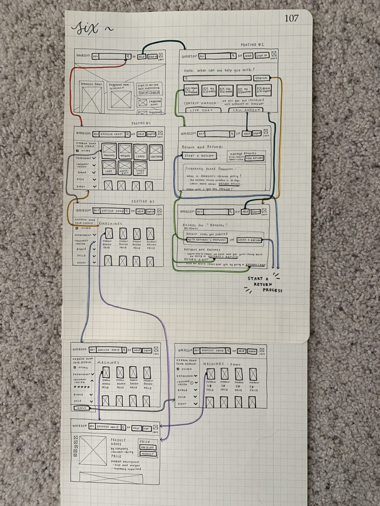
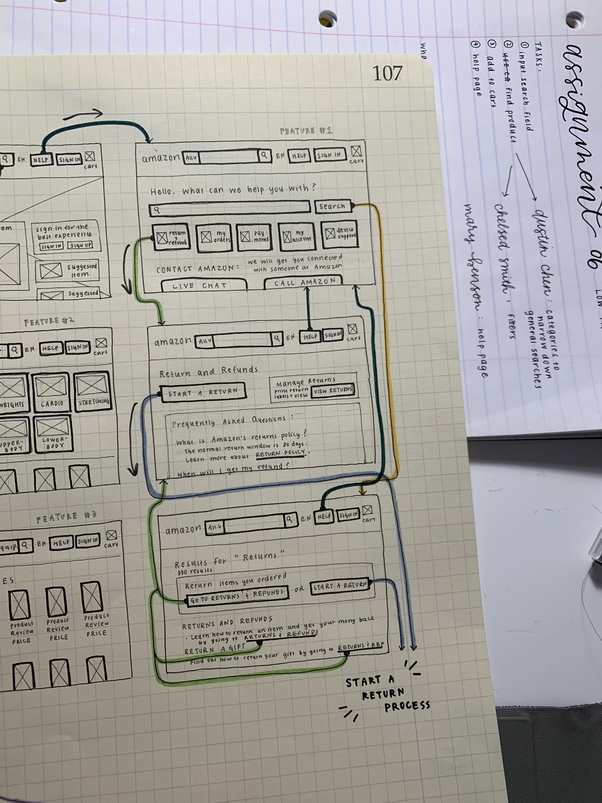
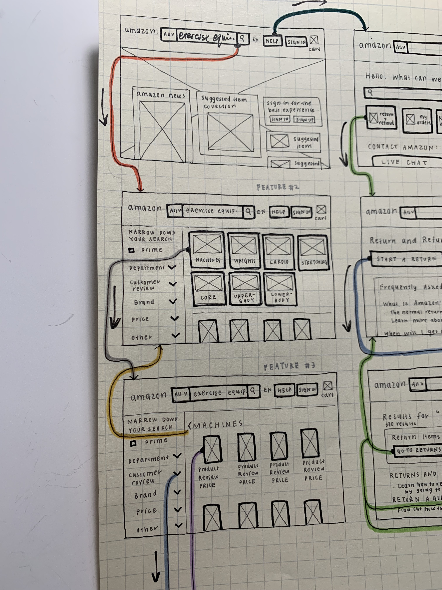
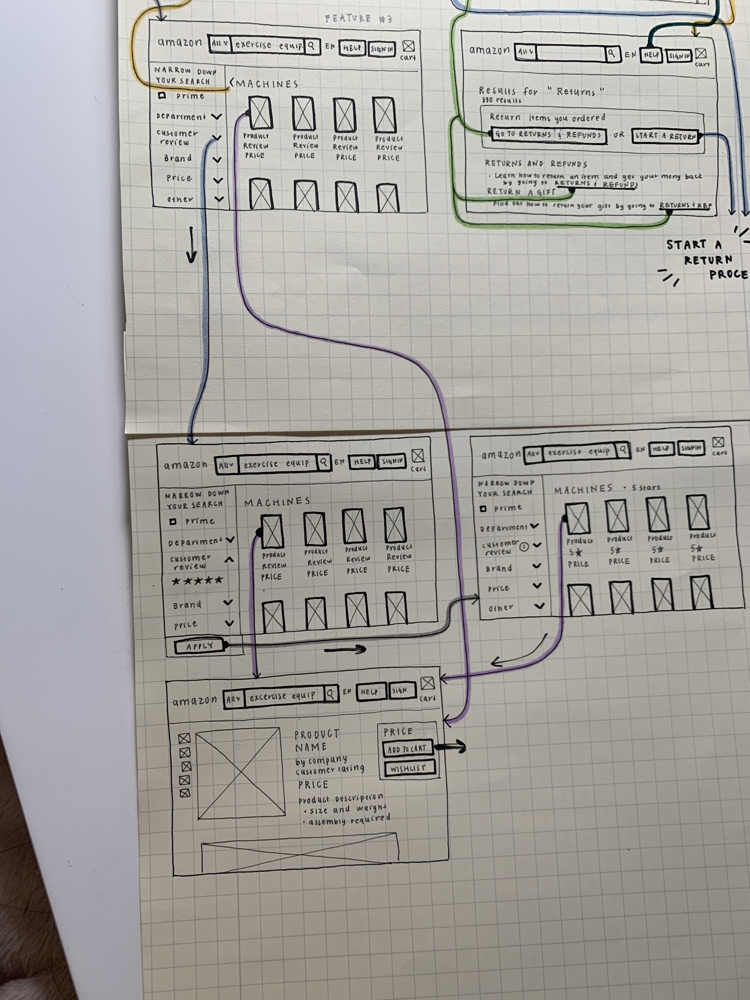
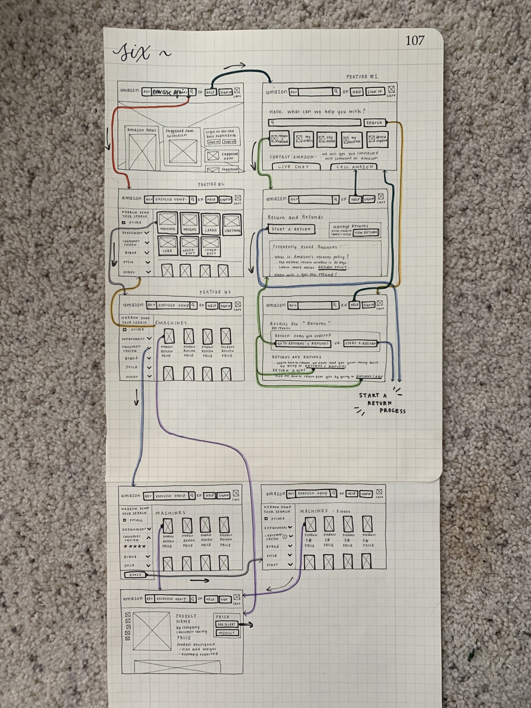

# DH150-ASSIGNMENT06
Claire Guo
DH150: User Experience Design

## Project Description
### Summary:
My user research project focuses on creating a quick, less frustrating, and more user-friendly online shopping experience for Amazon. While Amazon is a very well-known and widely-used website, there is large room for improvement for its user experience, especially in terms of accessibility, consistency, and functionality. The community of Amazon users is large, however, to accomodate users with less technological experience, Amazon needs a way to connect with their users quickly and directly. Through my user research and designs, I hope to make Amazon shopping experience faster, but still enjoyable for users, and make help on the website more accessible and personal. 

### Persona and Features:
According to my user research, I created three personas to highlight and find potential resolutions to issues in the current Amazon user experience design. The first persona is Austin Chen, a college student who wants to purchase exercise equipment from the comfort of his dorm room. He does not have a specific piece of equipment in mind and hopes to quickly browse Amazon's choices to find the perfect product. In order to make the broad range of search results more organized, I propose a feature in which Amazon will organize similar products into categories, making it easy for Austin to see what kinds of general products/exercise equipment is available on Amazon. The second persona is Chelsea Smith, a stay-at-home mom who needs to find a dress for a baby shower. She has specific details about the dress she wants - such as the color, price, and size of the dress. In order to narrow down Amazon's searches to only show the products that fit Chelsea's preferences, I propose a feature in which Amazon organizes their filters in drop-down menus so Chelsea will be able to clearly see all of the filters available and only have to change the filters she wants to manipulate. The third persona is Mary Benson, a retired teacher and new Amazon user who needs to return a laptop charger. She needs help processing her return. I propose a feature to make the help page more obvious and easily accessible so that new users can find help quickly without frustration.

Here is a summary of the three features in my following designs:

1. Categorical organization of search results

2. Concise filter settings 

3. Easy-access help page with contact information to Amazon

### Purpose:
The purpose of my low-fidelity prototypes is to check and test the functionality of my new designs. It allows me to translate my high-level design concepts into physical and tangible entities that other people can interact with in order to identify flaws in functionality. My low-fidelity prototype is used to test how the features I proposed flow within a user's online shopping experience, and focuses on its practicality rather than visual appearance. 

## Tasks
The low-fidelity prototype supports the following tasks:

1. Select Help

2. Search for help

3. Input search field

4. Narrow down search results using filters

5. Narrow down search results using categories

6. Select product

## Wireframes and Wireflow
What the user was told:
"This is a prototype for three new design features for Amazon. Please navigate through each screen, following the flow and arrows from one screen to the next after interacting with a button. The bolded rectangles and features are buttons. Use the black marker to mark which arrows you have followed. Your tasks are to 1. Find help on starting a return 2. Finding exercise equipment that is a machine and has a 5 star customer review." 

Flow Description: 
The flow designed above allows users to find help, search for products, and select/view products. The user can access the help page and search for help, click a help topic, or contact Amazon. When the user searches for help, they will be directed to a search results page where the user can find top results of pages containing the user's searched keywords. When the user clicks a help topic, they will be taken to the main page for the topic where they can access features to walk them through their concerns or needs. In addition, the flow designed allows the user to search for products in the search bar in the heading of the website. This will direct users to a list of search results and categories of results. If the user clicks on one of the categories, the page will refresh to show products that fit within that category. Users can also click on the filters they want to manipulate, which will drop down to show the filter features that the user can change to fit their wants and needs. When the user finishes implementing the filters, they press "Apply" to apply the filter and the screen will refresh to show the filtered results. Users can click on a product which will direct them to the product screen where they can view product details and add the item into their cart.

Features Description:
- HELP FEATURE: A "Help" button was clearly added to the header of the website so the page can be accessed at any time when navigating the website. The button leads user to a help page where there are three ways to find help: a search bar, help categories, and space to contact Amazon. 
- ITEM CATEGORY FEATURE: After the user searches for a general product, Amazon organizes similar search results into categories which show up at the top of the page in large buttons the user can press. The general pool of search results are available bleow the category boxes for users to browse through.
- FILTERS: Filter menu is always open on the left-side of the search results, and the type of filter is shown. If the user wants to manipulate the filter, they will click the drop-down menu and fill in their preferences. After selecting the filters, the user presses an "Apply" button to apply the filter(s) on the search results.

## Testing
Iteration #1: Finding Help and starting a return

The user did not search for returns or contact Amazon and just clicked the category box. The user did not go to the search results screen because she did not choose to search for help. This was not an unexpected results because the user just decided to find help by clicking the help category instead. This provides insight that if users find categories that align with what they need help with, they may be more likely to click the category box instead of searching their needs in the search bar. The tester was never confused or side-tracked and was able to find and quickly click the "Start a return" button, thereby successfully completing the task.

I believe that my design for this first feature worked very well because the user was able to successfully complete the task quickly without any confusion. Since the user chose to find help using categories instead of searching for her needs or contacting Amazon, I might improve my design to put the categories at the top of the page so it is the first help option users see when they access the page. In addition, by putting the categories at the top, then the search bar, then contact Amazon, it will allow users to search for help from general topics to very specific concerns. 

Iteration #2: Narrowing search options using categories

The user successfully completed the task of searching for "exercise equipment" and selecting the "machines" category to narrow search results to online show exercise machines. The user was side-tracked and questioned to herself if she wanted to filter the results first, or use the categories. 

Even though the tester was slightly side-tracked, I still believe the filter side-bar should be present at all times when users are viewing screens with search results. This is because users should have the option and freedom to adjust filters before selecting categories or vice versa. Therefore, I believe my design for this second feature worked well and the tester was not side-tracked because of a design flaw.

Iteration #3: Narrowing search options using customer review filter

The user did not successfully complete the task of applying a 5-star customer review filter. While the tester was able to successfully manipulate the filter to change and select the proper cutomer rating, the tester did not realize she had to press the "Apply" button to apply the filter.

In order to improve this design, I believe the "Apply" button should be removed and the filter should be autimatically applied after it has been manipulated. However, with multiple filter manipulations, this constant filter application and refreshing of the page may be frustrating and slow for users. Therefore, more research and investigation is required to see if an "Apply" button would be more efficient, especially if the user wants to manipulate multiple filters.

Final marked-up prototype after user interation:

## Reflection
The prototype testing could have been much better. While the testing was smooth in which the tester was able to clearly follow arrows from one screen to the next, one significant issue I found was that when the user tried to interact with a button on one screen, sometimes it did not lead to another screen. Therefore, the tester was more likely to click on the correct button because they saw that there was an arrow that lead it to the next page (For instance, the tester was more likely to click on the drop-down button for the correct filter because only the correct drop-down button had an arrow flowing to the next screen. If I had made flows for the other drop-down buttons, it would require the tester to really think through which button they would have to press to get their desired result). If I had made screens for each of the buttons on the screen, this would have reduced any bias for the user to pick the correct button to complete the task. In addition, I made the tasks too specific which made it easier for the user to navigate to the right pages. If I had given the tester more freedom in deciding what product or filter they wanted to set, it would increase the external validity of my design features.  
I learned that I need to make screens for every potential interaction for my low-fidelity prototype and that the screens should be general enough to fit a wide-range of tasks. I also learned that for every button, there must be a flow to another screen, because if not, it could lead to bias in testing.
In addition, for this assignment, I had the user manipulate filters (feature #3) after selecting categories (feature #2) for exercise equipment, which tested both features in one task. In order to view the success of each design feature separately, next time I should test them using different tasks instead of testing them together. Finally, using the feedback from my low-fidelity prototype task, I will improve my designs by rearranging the order in which help options are presented on the help page and remove the "Apply" button on the filter side-bar so that users do not have to click an extra button to apply their filters.

